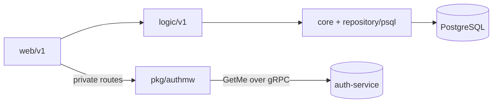

# AGENTS.md

Agent guide for `user-service`. Keep changes small, verified, and consistent
with the patterns below. Read the code before editing — this file describes
intent, the code is the source of truth.

## Contribution workflow

- Never commit or push to `main`. Branch, then open a PR.
- Branch names: `feat/…`, `fix/…`, `docs/…`, `chore/…`, `refactor/…`.
- One logical change per PR. Squash-merge.
- Commit subject: ≤ 50 chars, imperative mood, capitalised, no trailing period
  (`Add profile upsert path`, not `Added` / `Adds`).
- Commit body (only if non-trivial): wrap at 72 chars, explain *what* and *why*.
- Do **not** add attribution trailers (`Signed-off-by`, `Co-authored-by`,
  `Generated-by`, …), issue references (`Fixes #123`), or `@`-mentions.
- CI (`.github/workflows/check.yml`) runs `go-check` (test + lint), gitleaks,
  and sonar on every PR. Green is required.
- Before pushing or opening a PR, verify Sonar new-code coverage ≥ 80%: run
  `go test -race -coverprofile=coverage.out ./...` and confirm changed lines
  are covered, including **both** branches of any new conditional.
  `**/cmd/**`, `**/db/migrations/**`, `**/internal/core/repository/**` are
  coverage-excluded; everything else counts.

## Code quality

- Target Go 1.26 (`go.mod` pins `go 1.26.2`). Idiomatic Go only.
- Wrap errors with `fmt.Errorf("…: %w", err)`; return sentinel `domain.Err…`
  for known conditions. No naked `panic` outside `main` bootstrap.
- Always check error returns (or explicit `_ = fn()`).
- Constructor injection for dependencies; no hidden globals in new code.
- `golangci-lint` v2 (`.golangci.yml`) is authoritative. Common fixes:
  - `perfsprint`: `errors.New()` over `fmt.Errorf()` with no verbs.
  - `nosprintfhostport`: `net.JoinHostPort()` over `fmt.Sprintf("%s:%s", …)`.
  - `noctx`: `http.NewRequestWithContext()` over `http.NewRequest()`.
  - `goconst` / `gocognit`: extract repeated literals / helper functions.

## Project overview

User-management microservice: user lookup and profile read/write. HTTP-only
public surface (Gin); no gRPC server.

- Module: `github.com/duynhlab/user-service`.
- gRPC **client** of `auth-service` for token validation (see Conventions).
- Shared libs from `github.com/duynhlab/pkg` (`authmw`, `grpcx`, `obsx`,
  generated `proto/auth/v1`).

| Component | Technology |
|-----------|------------|
| Language  | Go 1.26 |
| Framework | Gin |
| Database  | PostgreSQL 16 via `pgx/v5` (`pgxpool`) |
| Auth      | gRPC client of `auth-service` (`pkg/authmw`, `pkg/grpcx`) |
| Logging   | Zap (structured, trace-correlated) |
| Tracing   | OpenTelemetry (OTLP → OTel Collector) |
| Metrics   | Prometheus (HTTP RED in-repo + gRPC client RED via `pkg/obsx`) |
| Profiling | Pyroscope |

## Repository layout

```
cmd/main.go                          # entrypoint: config, wiring, server, graceful shutdown
config/config.go                     # env-driven config + Validate()
internal/
  web/v1/                            # HTTP handlers, request binding/validation, DTO mapping
  logic/v1/                          # business rules, orchestration (NO SQL)
  core/
    database.go                      # pgxpool Connect() + DSN build (pooler-safe)
    domain/                          # models, sentinel errors, UserRepository interface
    repository/psql/                 # PostgreSQL UserRepository implementation (SQL lives here)
middleware/                          # tracing, logging, prometheus, profiling, resource
db/migrations/                       # golang-migrate SQL (sql/000001_*.up.sql) embedded via embed.go
Dockerfile                           # service image (distroless-style alpine)
```

## Build, test, lint

```bash
GOTOOLCHAIN=auto go build ./...
GOTOOLCHAIN=auto go vet ./...
GOTOOLCHAIN=auto go test ./...
golangci-lint run
```

One-liner before pushing:

```bash
GOTOOLCHAIN=auto go build ./... && GOTOOLCHAIN=auto go test ./... && golangci-lint run
```

## Conventions

### 3-layer architecture (Web → Logic → Core)

One-way dependency: `web → logic → core`, never reverse. Core imports nothing
from `web` or `logic`.

| Layer | Path | Do | Don't |
|-------|------|----|-------|
| Web   | `internal/web/v1/` | HTTP handling, JSON binding, validation, error→status, call Logic | SQL, direct DB access, business rules |
| Logic | `internal/logic/v1/` | Business rules, orchestration, call repository interfaces | SQL, `*gin.Context`, import `gin`, touch the pool |
| Core  | `internal/core/` | Domain models, repository impl, SQL, DB pool | HTTP handling, business orchestration |

- Define repository interfaces in `core/domain`; depend on the interface from
  Logic, inject the `psql` implementation in `cmd/main.go`.
- Web must call Logic, never `core/repository` directly. Logic must not skip to
  the pool.

### gRPC client → auth (`pkg/authmw`)

`user-service` is a gRPC **client** of `auth-service`; it runs no gRPC server.

- `private` routes use `authmw.Middleware(authClient)`. It forwards the incoming
  `Authorization` header to `auth.v1.AuthService/GetMe` over gRPC.
- Target is `AUTH_GRPC_ADDR` (default `dns:///auth.auth.svc.cluster.local:9090`),
  dialled via `pkg/grpcx`.
- **Fail-closed**: no header → 401; `Unauthenticated` → 401; any other error
  (auth unreachable, internal) → 503.
- On success it sets `user_id`, `username`, `email` in the gin context —
  handlers read these. Do **not** parse JWTs per-service; the shared middleware
  is the single source of fail-closed behaviour.

### Observability (`pkg/obsx`, single `/metrics`)

- One Prometheus endpoint at `/metrics`. HTTP RED metrics come from
  `middleware/prometheus.go`. In `main()`, `obsx.SetupMetrics()` installs a
  global OTel meter provider on the **default** Prometheus registry so the
  otelgrpc handler in `pkg/grpcx` lands gRPC client RED metrics (`rpc_client_*`)
  on the **same** `/metrics`. No separate metrics port.
- Logging derives `trace_id` from `obsx.TraceIDFromContext(ctx)` so logs and
  traces correlate; header / generated-ID fallback only when no span exists.
- Middleware order — **do not reorder**:

  ```
  TracingMiddleware → LoggingMiddleware → PrometheusMiddleware
  ```

  Tracing runs first so logging and metrics observe the active span.

### Diagrams

Use **Mermaid** for all diagrams. No ASCII art.



### Routes (Variant A — `/{service}/v1/{audience}/…`)

Routes mount directly on the Gin router; Kong is pure pass-through for
`public`/`private`. `internal` is reachable only via service DNS.

| Method | Path | Audience |
|--------|------|----------|
| `GET`  | `/user/v1/public/users/:id` | public |
| `GET`  | `/user/v1/private/users/profile` | private |
| `PUT`  | `/user/v1/private/users/profile` | private |
| `POST` | `/user/v1/internal/users` | internal (called by `auth-service` at registration) |

## Gotchas

### Data-access pattern (read the code)

- The `psql.UserRepository` takes a `*pgxpool.Pool` via constructor injection
  (`NewUserRepository(pool)` in `cmd/main.go`). The package-global
  `database.GetPool()` / `GetDB()` still exist but are **not** used by the
  repository — prefer the injected pool; don't reach for the global in new code.
- `core/database.Connect()` returns the pool **and** sets the global; pass the
  returned pool through wiring.
- `GetUser` is a **stub**: it synthesises a `domain.User` from the id and
  returns `ErrUserNotFound` for `id == "999"`. It runs **no SQL** because
  `user-service` does not own the `users` table (`auth-service` does). Only the
  profile paths hit real SQL against `user_profiles`
  (`GetProfileByUserID`, `CreateUserProfile`, `UpdateUserProfile`,
  `CheckProfileExists`, `UpsertUserProfile`). Don't "fix" `GetUser` to query a
  table that isn't owned here.
- DB connects in `pgx.QueryExecModeSimpleProtocol` with statement caching
  disabled for transaction-mode poolers (PgBouncer). Keep that when touching
  `database.go`.

### Container images (Kyverno-enforced)

- Service image base is pinned (`golang:1.26.3-alpine`, `alpine`). Pin tags or
  digests for any new image — **never `:latest`** on workloads; the cluster's
  Kyverno policies reject it.

### Database migrations

- Migrations use **golang-migrate v4.19.1**, embedded in the app binary via
  `embed.FS` (`db/migrations/embed.go`) and applied through `pkg/migratex`.
- Forward-only SQL files live in `db/migrations/sql/` as `000001_*.up.sql`.
- A `migrate` subcommand runs them; the init container reuses the **app image**
  (`args: ["migrate"]`), so there is no separate migration image, Dockerfile, or
  `.trivyignore` to maintain.
